# Docker y Docker Compose

## Archivos del Ejercicio
- Jupyter Notebook con prueba de conexión entre el contenedor de Jupyter y MySQL Server [docker.ipynb](docker.ipynb)
- Definición de Docker Compose: [docker-compose.yml](docker-compose.yml)
- Jupyter Notebook con prueba de conexión entre contenedores creados con Docker Compose [docker-compose.ipynb](docker-compose.ipynb)

## Ejecutando contenedores con Docker

Creamos la red my_test_network con el comando **docker network create**

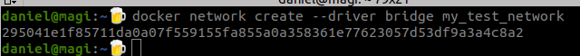

Hacemos pull de de imagen de Jupyter Notebook  con el comando **docker pull**

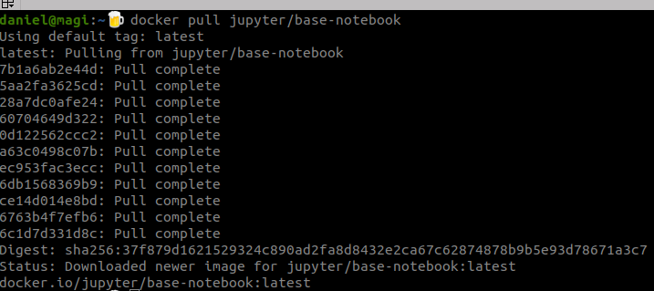

Creamos un contenedor de Jupyter en el puerto TCP 8888 y red my_test_network

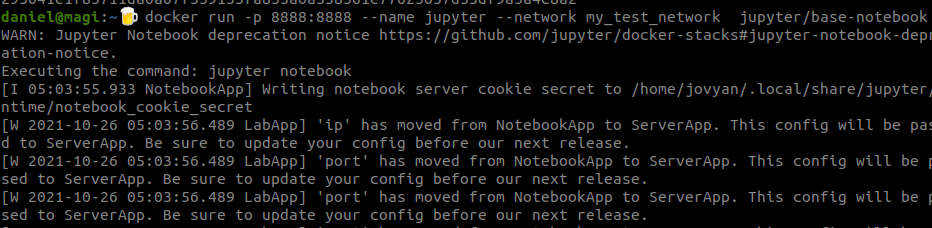

Hacemos pull de de imagen de MySQL versión 5.7.35

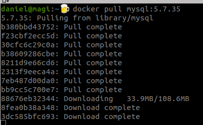

Creamos el contenedor de MySQL con las respectivas variables de entorno en el puerto TCP 3306 y red my_test_network

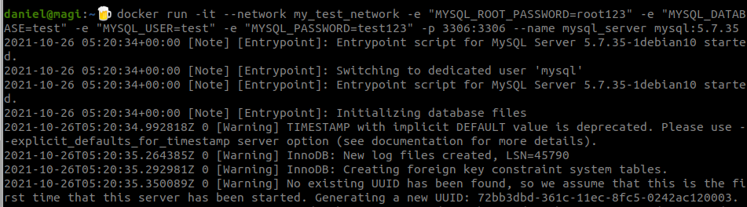

Probamos la conexión al servidor de MySQL desde el cliente de MySQL

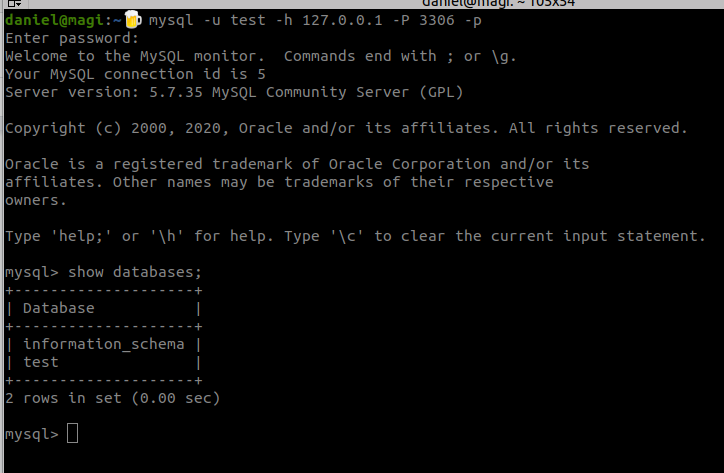

Validamos que ambos contenedores se encuentren corriendo con el comando **docker ps**

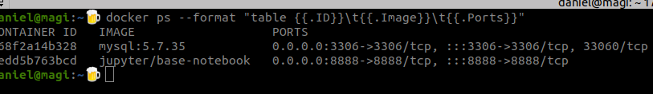

Instalamos mysql-connector-python en el contenedor de Jupyter

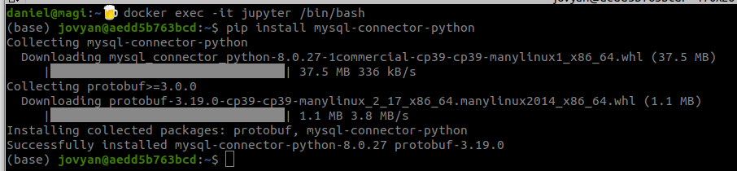

Se confirma la IP del contenedor de MySQL con el comando **docker inspect my_test_network**

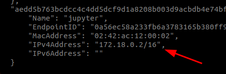

Probamos la conexión desde el contenedor de Jupyter hacia MySQL

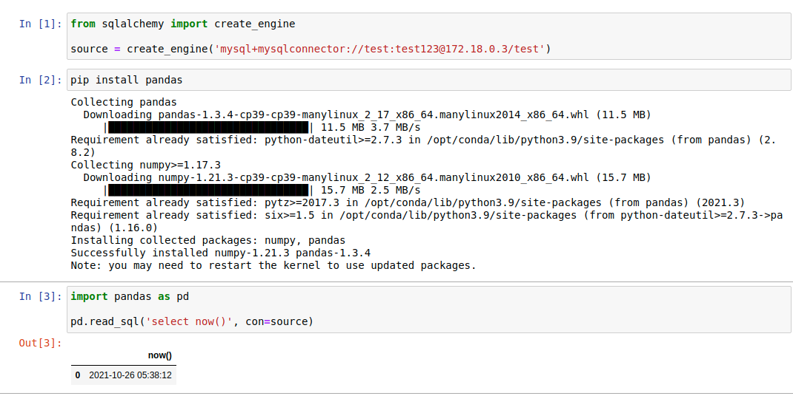

## Docker Compose

Definimos el archivo **docker-compose.yml** para los contenedores de Jupyter Notebooks y MySQL

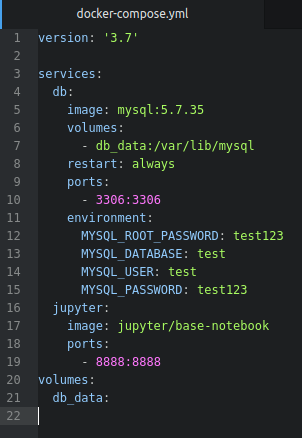

Iniciamos los contenedores con el comando **docker-compose up**

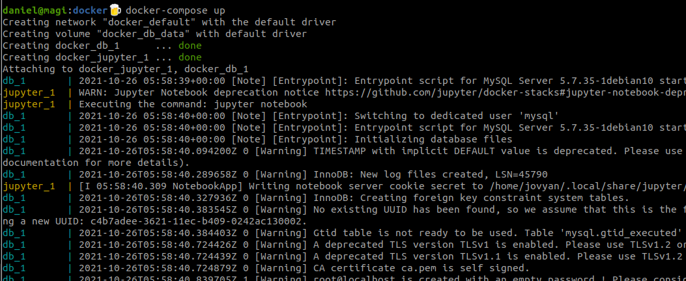

Validamos la conexión desde el contenedor de Jupyter Notebook hacia MySQL Server

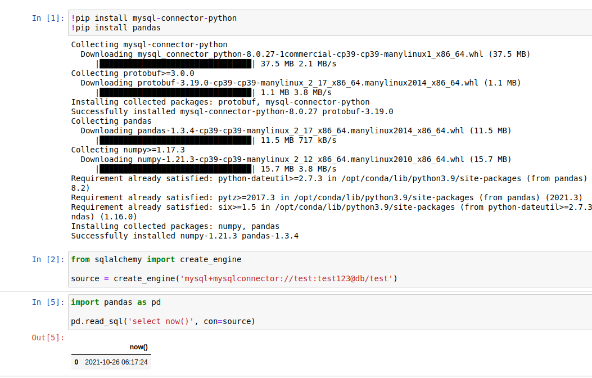
