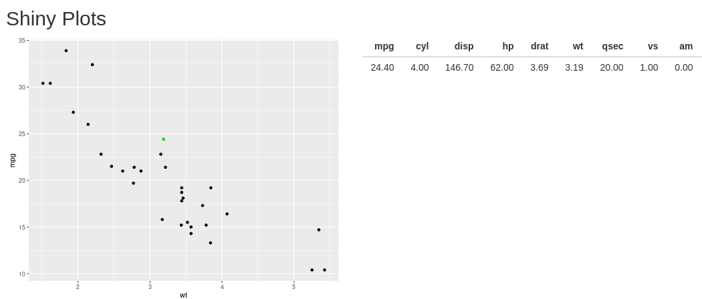
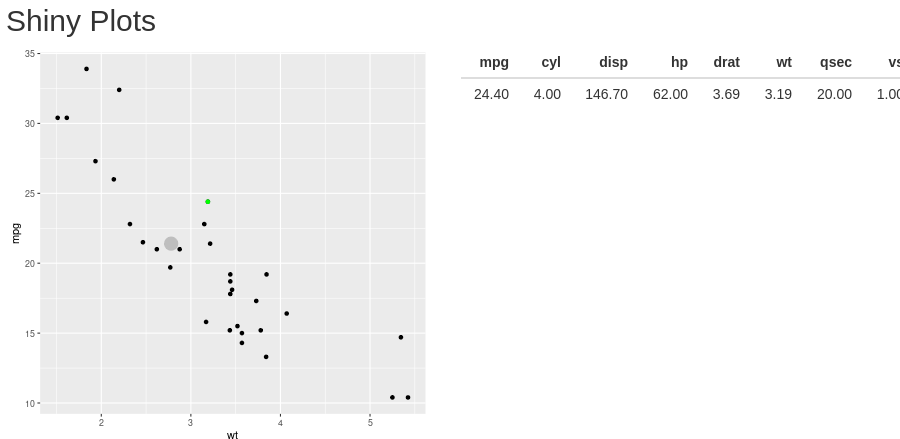
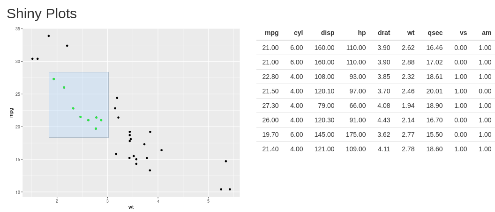
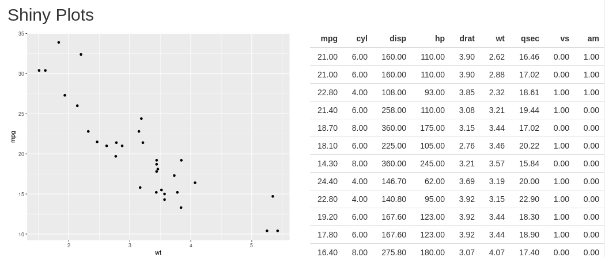

# Shiny Plots

## On click

El punto seleccionado se cambia a color verde y se muestra en la tabla.

## On Hover

El punto seleccionado se cambia a color gris y se aumenta de tamaño para que pueda visualizarse mejor..

## On Brush

Se cambian a color verde los puntos seleccionados.

## On doble click

Se limpian los puntos seleccionados y se muestran todos los elementos de la tabla.

